# IoT Object & Obstacle Detection and Radar Visualization

A smart for object detection and obstacle-detection system utilizing an ESP32, an HC-SR04 ultrasonic sensor, a servo motor, MQTT communication, and interactive Python/Pygame/Matplotlib visualizations.

---

# Table of Contents
- [1. The Story of Ultrasonic and Servo Integration](#1-the-story-of-ultrasonic-and-servo-integration)
- [2. System Architecture](#2-system-architecture)
- [3. Setup and Installation Evidence](#3-setup-and-installation-evidence)
- [4. Wiring Diagram and Pins](#4-wiring-diagram-and-pins)
- [5. How to Run the Project](#5-how-to-run-the-project)

---

## 1. The Story of Ultrasonic and Servo Integration

Imagine an autonomous vehicle driving through a crowded room, a humanoid robot navigating around furniture, or a restricted sterile lab that must remain completely empty. To operate safely, these machines need to "see" and map their environments. While high-end cameras and LiDAR sensors are powerful, they are expensive, heavy, and require massive processing power. 

This project solves that problem with a simple, elegant, and low-cost combination: an **HC-SR04 Ultrasonic Sensor** paired with a **Servo Motor**.

Here is how the story unfolds:
1. **The Single Beam**: On its own, an ultrasonic sensor acts like a flashlight. It emits high-frequency sound waves in a straight line. When the wave hits an object, it bounces back. By measuring how long the echo takes to return, the sensor calculates the exact distance. However, it is blind to anything slightly to the left or right.
2. **Adding Motion**: By mounting the ultrasonic sensor onto a rotating servo motor, we give it "neck" movement. As the servo sweeps back and forth from $0^\circ$ to $180^\circ$, the ultrasonic sensor constantly fires sound waves. 
3. **From Distance to Radar**: This sweeps the area like a naval radar. Instead of a single distance reading, we get a full sweep of data points (angles and distances). This creates a 2D map of the surrounding environment.
4. **Triggering Responses**: If an object enters a defined safety perimeter (for example, closer than 50 cm), the system instantly triggers safety protocols:
   - **Autonomous Vehicles** can stop or steer away to avoid collisions.
   - **Humanoid Robots** can adjust their steps or change directions.
   - **Sterile & Restricted Areas** can trigger alarms, turn on warning lights, or activate cameras.

---

## 2. System Architecture

The project connects hardware, a containerized message broker, and GUI visualization tools into a seamless pipeline.

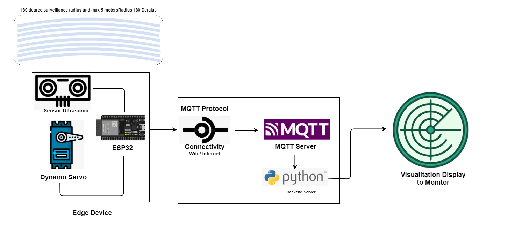

### Architecture Explanation
1. **Edge Hardware (ESP32)**:
   - The **ESP32 microcontroller** controls the **Servo Motor** and triggers the **HC-SR04 Ultrasonic Sensor**.
   - As the servo sweeps, the ESP32 reads the distance data and formats it into a simple message: `angle,distance`.
   - Using its built-in Wi-Fi, the ESP32 connects to the local network and publishes this data to an MQTT topic (`esp32/radar`).
2. **Message Broker (Eclipse Mosquitto)**:
   - Runs inside a lightweight **Docker Container** on the host machine.
   - It acts as the post office (broker), receiving telemetry from the ESP32 and routing it to any subscribed application.
3. **Data Processor & GUI Visualization**:
   - The Python applications (`radar_mapper.py` for polar radar, `mapping_space.py` for grid/point cloud maps) run in a Python container.
   - They subscribe to the MQTT topic, process incoming coordinates, and render real-time interactive maps.
   - To display the GUI window from inside Docker onto Windows, **X11 forwarding** is configured, routing the display signals to the host's Windows X-Server (VcXsrv).

---

## 3. Setup and Installation Evidence

Below is a detailed walkthrough of the environment setup, configuration, and verification steps based on project screenshots:

### 3.1. Docker Compose Deployment
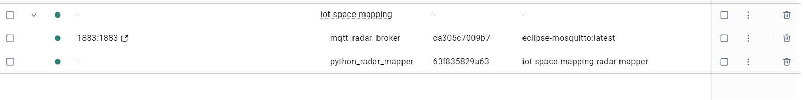
This screenshot shows the initialization and execution of the multi-container environment using `docker-compose up`. The environment spins up the Mosquitto MQTT broker (`mqtt_radar_broker`) and the Python container (`python_radar`). The containers communicate on a shared network, letting the python scripts automatically ingest data published to the broker.

### 3.2. X-Server (VcXsrv) Configuration
To allow Pygame and Matplotlib to draw GUI windows from inside the Linux-based Docker containers onto Windows, VcXsrv is installed and configured as follows:

- **Step 1: Select display settings**
  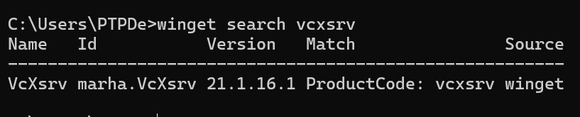
  Here, we choose **Multiple windows** and set the display number to `0`. This configures VcXsrv to render GUI windows as normal, floating Windows applications instead of a single fullscreen virtual desktop.

- **Step 2: Client startup options**
  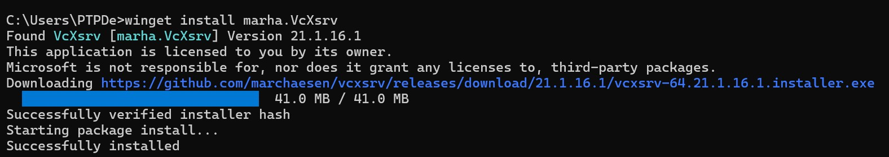
  We choose **Start no client**. This configures VcXsrv to run passively in the background as a server, waiting for external graphical connections (like our Docker container) rather than launching an X client program immediately.

- **Step 3: Extra Settings**
  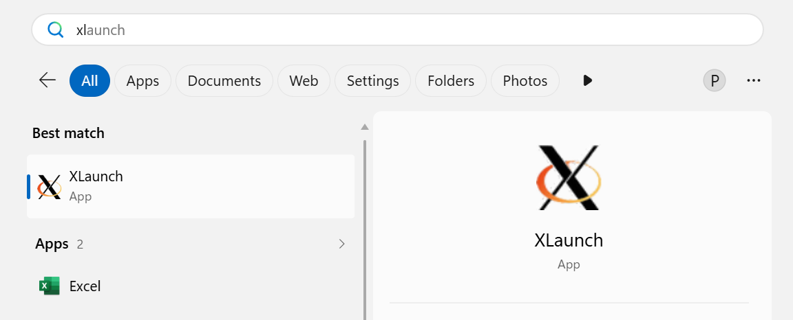
  This is a **critical security step**. We must check **Disable access control**. This permits the Docker container (which connects from a virtual IP range) to bypass host authentication rules and successfully stream GUI output to the Windows host screen.

- **Step 4: Save configuration**
  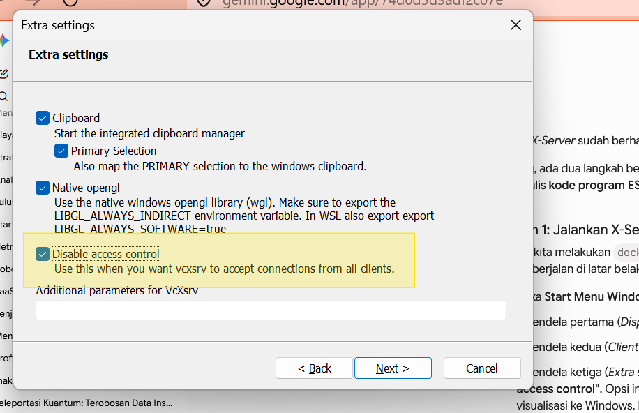
  We complete the installation and save the configuration file so VcXsrv can be launched with these identical parameters in the future.

### 3.3. MQTT Broker & Client Connection Verification
- **Broker logs**
  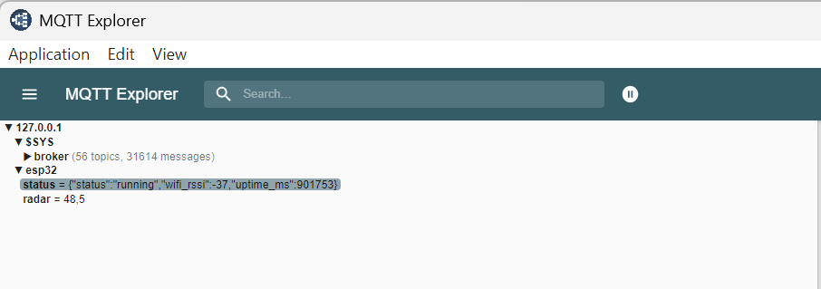
  This screenshot shows the console logs of the running Mosquitto MQTT broker container. The output confirms that the broker is listening on port `1883` and successfully accepts incoming TCP connections.

- **ESP32 Connection to MQTT**
  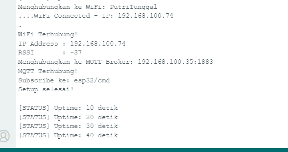
  This shows that the ESP32 client is successfully connecting to the Mosquitto broker and starts publishing the radar angle and distance data.

- **Broker communication testing**
  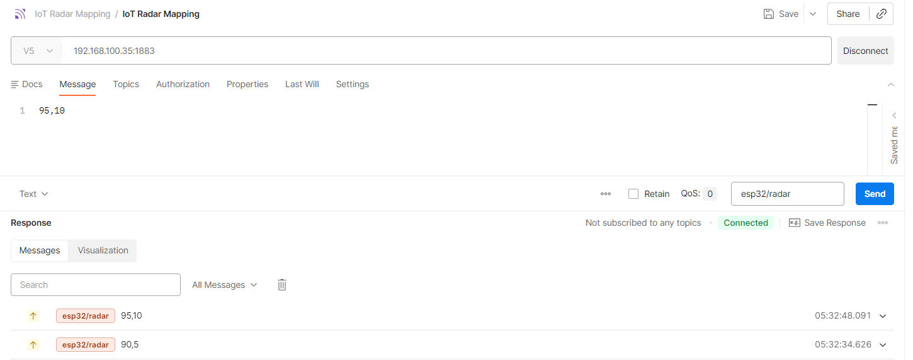
  Using Postman's MQTT client, we connect directly to the broker to verify that messages are properly routed. The test confirms that simulated sensor payloads (such as publishing distance and angle data) are correctly received and formatted.

### 3.4. Final GUI Visualization Output
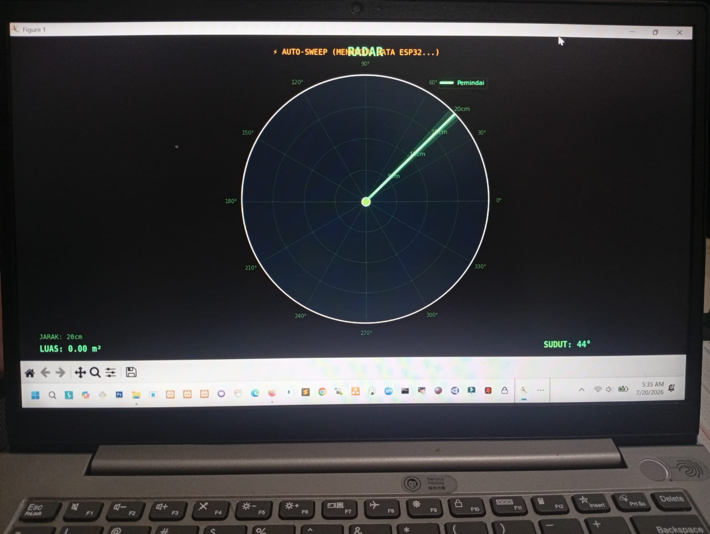
This screenshot showcases the final running visualization from `radar_mapper.py`. The dark-themed polar radar dashboard displays:
- A sweeping **radar line** in bright green representing the current servo angle.
- Red **obstacle dots (Point Cloud)** showing mapped object locations.
- **Data readouts** displaying the calculated space area in real time, the current sweep angle, and the detected distance.

### 3.5. Hardware Setup & Real-time Integration Evidence
- **Physical Microcontroller Setup**
  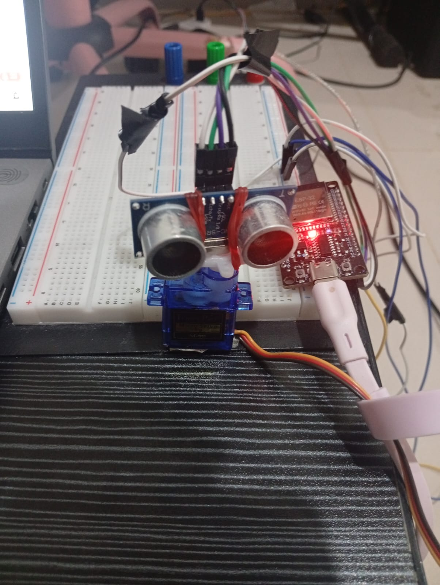
  This image shows the actual physical wiring and setup of the ESP32 connected to the SG90 servo motor and the HC-SR04 ultrasonic sensor.

- **Real-time Visualization and Microcontroller Alignment**
  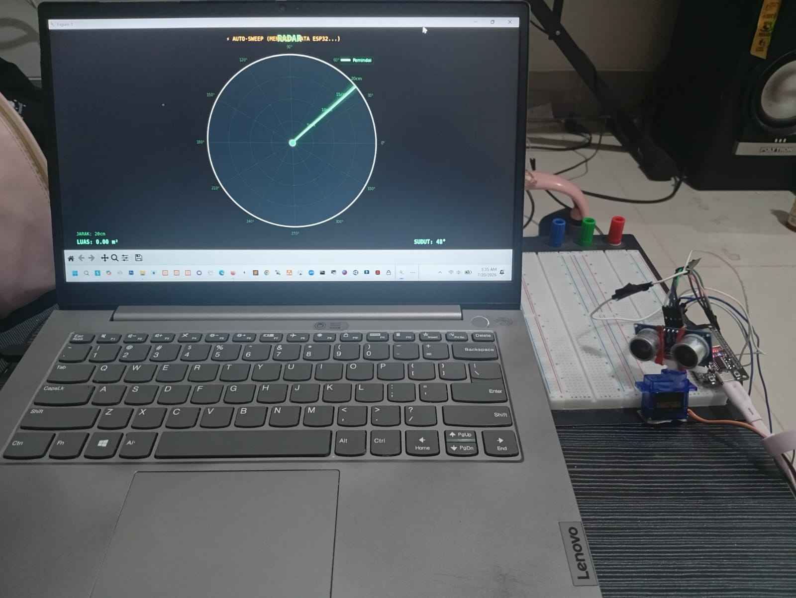
  This highlights the complete end-to-end integration: the hardware sweeps physically while the Python GUI maps the obstacles on the screen in real-time.

---

## 4. Wiring Diagram and Pins

To connect the physical hardware to the ESP32 microcontroller, refer to the wiring layout below:

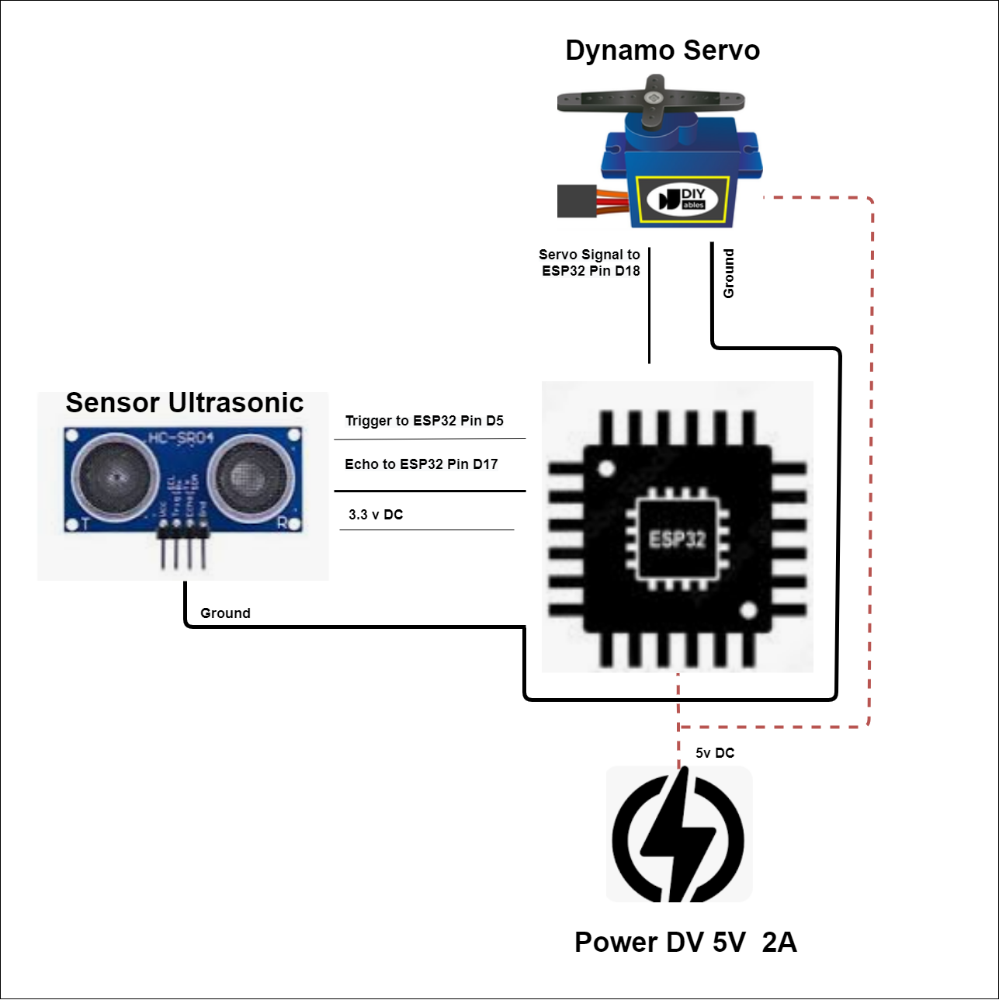

### Hardware Pin Mapping
- **HC-SR04 Ultrasonic Sensor**:
  - **VCC** $\rightarrow$ ESP32 5V / 3.3V
  - **GND** $\rightarrow$ ESP32 GND
  - **Trig** $\rightarrow$ ESP32 GPIO 5 (D1)
  - **Echo** $\rightarrow$ ESP32 GPIO 17 (D2)

- **Servo Motor**:
  - **VCC (Red)** $\rightarrow$ ESP32 5V (or external 5V power supply)
  - **GND (Brown/Black)** $\rightarrow$ ESP32 GND
  - **Signal (Orange/Yellow)** $\rightarrow$ ESP32 GPIO 18

---

## 5. How to Run the Project

### 5.1. Start the X-Server
Launch **VcXsrv** on Windows using the saved configuration file (ensure "Disable access control" is checked).

### 5.2. Run the Application with Docker Compose
Run the following command in your terminal to start the MQTT broker and visualization GUI:
```bash
docker-compose up
```

### 5.3. Upload Code to ESP32
Open [main.ino](file:///d:/mygithub-research/iot/iot-space-mapping/microcontroller/main/main.ino) in the Arduino IDE, update your Wi-Fi SSID, Password, and your computer's IP address (MQTT Broker Host), and flash it to the ESP32.
